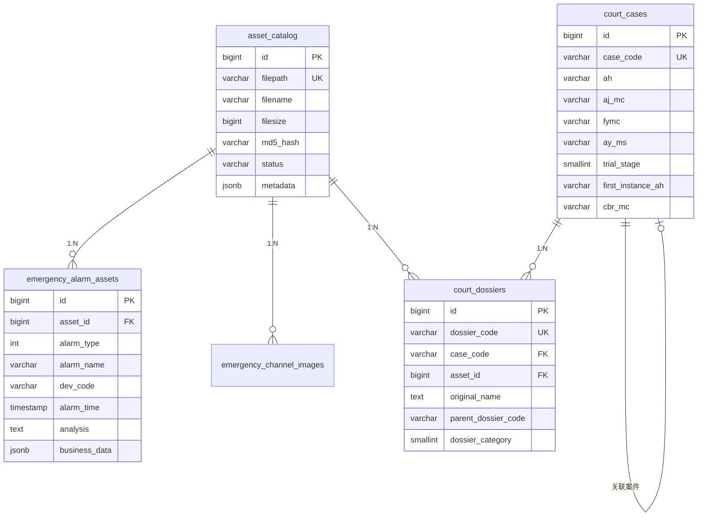

# 数据库表结构说明文档

> 文档版本: v1.0  
> 更新日期: 2026-01-15  
> 数据库类型: PostgreSQL 15

---

## 一、核心公共表

### 1.1 asset_catalog（资产目录表）

所有业务资产的核心表，存储文件物理属性和基础标签。

| 字段 | 类型 | 说明 |
|------|------|------|
| `id` | BIGSERIAL | 主键 |
| `filepath` | VARCHAR(1024) | NAS文件完整路径（唯一） |
| `filename` | VARCHAR(512) | 文件名 |
| `filesize` | BIGINT | 文件大小(字节) |
| `file_ext` | VARCHAR(20) | 文件扩展名 |
| `mtime` | TIMESTAMP | 文件修改时间 |
| `md5_hash` | VARCHAR(32) | MD5哈希指纹 |
| `industry` | VARCHAR(64) | 行业分类 |
| `category` | VARCHAR(128) | 一级分类 |
| `subcategory` | VARCHAR(128) | 二级分类 |
| `year` | INTEGER | 年份 |
| `quarter` | VARCHAR(10) | 季度 |
| `status` | VARCHAR(20) | 状态: ready/deprecated/error/processing |
| `metadata` | JSONB | 扩展元数据 |
| `registered_at` | TIMESTAMP | 注册时间 |

**索引**: `filepath`, `md5_hash`, `mtime`, `status`, `(industry, category)`, `metadata(GIN)`

---

## 二、应急安全模块

### 2.1 emergency_alarm_assets（告警图片资产表）

存储应急安全告警图片及其业务数据。

| 字段 | 类型 | 说明 |
|------|------|------|
| `id` | BIGSERIAL | 主键 |
| `asset_id` | BIGINT | 关联 asset_catalog.id |
| `alarm_id` | INTEGER | 原始告警ID |
| `alarm_type` | INTEGER | 告警类型: 400/401/402 |
| `alarm_name` | VARCHAR(32) | 告警名称（如：火点检测报警事件） |
| `dev_code` | VARCHAR(64) | 设备编码 |
| `alarm_time` | TIMESTAMP | 告警时间 |
| `source_table` | VARCHAR(64) | 数据来源表 |
| `analysis` | TEXT | AI分析结果 |
| `area_code` | VARCHAR(64) | 区域编码 |
| `status` | SMALLINT | 告警状态: 1待复核/2已处理 |
| `business_data` | JSONB | 扩展业务字段 |

**business_data JSONB 结构**:
```json
{
  "dev_name": "设备名称",
  "channel_code": "通道编码",
  "channel_name": "通道名称",
  "area_name": "区域名称",
  "process_user_id": 123,
  "process_user_name": "处理人",
  "process_time": "2024-01-01 12:00:00",
  "source": 1,
  "level": 2,
  "analysis_time": "2024-01-01 12:00:05"
}
```

**索引**: `asset_id`, `alarm_id`, `alarm_time DESC`, `alarm_type`, `alarm_name`, `dev_code`, `(area_code, alarm_time)`, `business_data(GIN)`

---

### 2.2 emergency_channel_images（通道图片资产表）

存储视频通道截图及其元数据。

| 字段 | 类型 | 说明 |
|------|------|------|
| `id` | BIGSERIAL | 主键 |
| `asset_id` | BIGINT | 关联 asset_catalog.id |
| `channel_code` | VARCHAR(255) | 通道编码 |
| `image_type` | VARCHAR(32) | 图片类型: snapshot/map/other |
| `area_code` | VARCHAR(255) | 区域编码 |
| `latitude` | DOUBLE PRECISION | 纬度 |
| `longitude` | DOUBLE PRECISION | 经度 |
| `channel_info` | JSONB | 扩展通道信息 |

---

## 三、法院卷宗模块（规划中）

### 3.1 court_cases（案件主表）

> 对应源系统表: `judge_ai_case`

| 字段 | 类型 | 说明 |
|------|------|------|
| `id` | BIGSERIAL | 主键 |
| `case_code` | VARCHAR(128) | 案件唯一编号 |
| `ah` | VARCHAR(45) | 案号（如：(2024)浙01民初123） |
| `aj_mc` | VARCHAR(1024) | 案件名称 |
| `fymc` | VARCHAR(128) | 法院名称 |
| `ent_code` | VARCHAR(128) | 法院分级码 |
| `ajlx_id` | VARCHAR(32) | 案件类型编号 |
| `ajlx_mc` | VARCHAR(1024) | 案件类型描述 |
| `ay_id` | VARCHAR(32) | 案由编号 |
| `ay_ms` | VARCHAR(1024) | 案由描述 |
| `trial_stage` | SMALLINT | 审判阶段: 1=一审, 2=二审 |
| `first_instance_ah` | VARCHAR(255) | 一审案号（二审时关联） |
| `cbr_code` | VARCHAR(128) | 承办人编号 |
| `cbr_mc` | VARCHAR(32) | 承办人名称 |
| `fgzl_code` | VARCHAR(128) | 法官助理编号 |
| `fgzl_mc` | VARCHAR(32) | 法官助理名称 |
| `cbbm_code` | VARCHAR(128) | 承办部门编号 |
| `cbbm_mc` | VARCHAR(32) | 承办部门名称 |
| `larq` | VARCHAR(22) | 立案日期 |
| `ktrq` | DATE | 开庭日期 |
| `bdje` | FLOAT | 标的金额 |
| `close_status` | SMALLINT | 结案状态: 0=未结案, 1=已结案 |
| `ys_ah` | VARCHAR(255) | 原审案号 |
| `ys_fymc` | VARCHAR(255) | 原审法院名称 |
| `ys_ajbh` | VARCHAR(255) | 原审案件编号 |
| `judgement_status` | SMALLINT | 判决书状态: 1=待生成, 2=已生成 |
| `sync_dossier_status` | SMALLINT | 卷宗同步状态: 1=未同步, 2=同步中, 3=已同步 |
| `created_at` | TIMESTAMP | 创建时间 |
| `updated_at` | TIMESTAMP | 更新时间 |

**索引**: `case_code`, `ah`, `ent_code`, `cbr_code`, `larq`, `ktrq`

---

### 3.2 court_dossiers（卷宗表）

> 对应源系统表: `judge_ai_case_dossier`

| 字段 | 类型 | 说明 |
|------|------|------|
| `id` | BIGSERIAL | 主键 |
| `dossier_code` | VARCHAR(128) | 卷宗唯一标识号 |
| `case_code` | VARCHAR(128) | 案件唯一编号（关联 court_cases） |
| `asset_id` | BIGINT | 关联 asset_catalog.id |
| `original_name` | TEXT | 原始文件名 |
| `original_suffix` | VARCHAR(64) | 文件类型（小写） |
| `parent_dossier_code` | VARCHAR(128) | 父节点（目录结构） |
| `sfml` | SMALLINT | 是否目录: 0=否, 1=是 |
| `file_code` | VARCHAR(128) | 文件唯一标识号 |
| `priority` | INTEGER | 排序优先级 |
| `dossier_type` | INTEGER | 卷宗类型: 0=卷宗, 1=当庭证据 |
| `dossier_category` | SMALLINT | 卷宗分类（见下表） |
| `classify` | VARCHAR(255) | 卷宗分类文本 |
| `summary` | TEXT | 文件摘要 |
| `cpm_status` | SMALLINT | OCR识别状态: 1=待识别, 2=成功 |
| `simplify_status` | SMALLINT | 文本精简状态: 1=待精简, 2=完成 |
| `rag_status` | SMALLINT | RAG入库状态: 1=待入库, 2=入库中, 3=成功 |
| `upload_time` | VARCHAR(255) | 上传时间 |
| `created_at` | TIMESTAMP | 创建时间 |
| `updated_at` | TIMESTAMP | 更新时间 |

#### dossier_category 枚举值

| 值 | 含义 | 值 | 含义 |
|----|------|----|------|
| 1 | 起诉状 | 8 | 反诉状 |
| 2 | 答辩状 | 9 | 量刑建议书 |
| 3 | 证据 | 10 | 行政复议决定书 |
| 4 | 其他文件 | 11 | 立案审批表 |
| 5 | 原审判决书 | 12 | 调解笔录 |
| 6 | 庭审笔录 | 13 | 调解协议 |
| 7 | 诉讼请求变更申请 | | |

**索引**: `dossier_code`, `case_code`, `file_code`, `sfml`, `dossier_category`, `cpm_status`

---

## 四、辅助运维表

### 4.1 data_issues（数据问题反馈表）

记录数据质量问题。

| 字段 | 类型 | 说明 |
|------|------|------|
| `id` | BIGSERIAL | 主键 |
| `asset_id` | BIGINT | 关联资产ID |
| `filepath` | VARCHAR(1024) | 文件路径 |
| `issue_type` | VARCHAR(32) | 问题类型: corrupt/missing/format_error |
| `error_msg` | TEXT | 错误信息 |
| `reported_by` | VARCHAR(64) | 报告人 |
| `status` | VARCHAR(20) | 状态: pending/resolved/ignored |

---

### 4.2 file_operation_log（文件操作日志表）

审计所有文件操作。

| 字段 | 类型 | 说明 |
|------|------|------|
| `id` | BIGSERIAL | 主键 |
| `operation_type` | VARCHAR(20) | 操作类型: upload/delete/move/rename/copy |
| `filepath_old` | VARCHAR(1024) | 原路径 |
| `filepath_new` | VARCHAR(1024) | 新路径 |
| `operated_by` | VARCHAR(64) | 操作人 |
| `operated_at` | TIMESTAMP | 操作时间 |
| `status` | VARCHAR(20) | 结果: success/failed |

---

### 4.3 asset_scan_tasks（资产扫描任务表）

监控注册脚本运行状态。

| 字段 | 类型 | 说明 |
|------|------|------|
| `id` | BIGSERIAL | 主键 |
| `scan_directory` | VARCHAR(512) | 扫描目录 |
| `files_scanned` | INTEGER | 扫描文件数 |
| `files_added` | INTEGER | 新增文件数 |
| `files_updated` | INTEGER | 更新文件数 |
| `task_status` | VARCHAR(20) | 状态: running/completed/failed |
| `task_start_time` | TIMESTAMP | 开始时间 |
| `task_end_time` | TIMESTAMP | 结束时间 |

---

## 五、视图

| 视图名 | 说明 |
|--------|------|
| `v_alarm_assets_full` | 告警资产完整视图（封装JSONB字段） |
| `v_channel_images_full` | 通道图片完整视图 |
| `v_scan_tasks_summary` | 扫描任务按日统计 |

---

## 六、ER 图



---

## 七、NAS 存储目录规划

```
/data/nas_data/
├── 00_Work_Area/              # 工作区（FileBrowser管理）
│   ├── new_uploads/           # 新上传待处理
│   └── trash_bin/             # 回收站
│
└── 10_Official_Library/       # 正式资产库
    ├── 01_法院_司法/
    │   ├── 01_法律法规库/
    │   ├── 02_裁判文书库/     # 按年份/案件类型组织
    │   │   └── 2026/
    │   │       ├── 刑事/
    │   │       └── 民事/
    │   ├── 03_电子卷宗库/     # 完整卷宗文件
    │   └── 04_业务参考库/
    │
    ├── 02_应急_安全/
    │   ├── 01_告警图片/       # 按日期组织
    │   ├── 02_通道图片/
    │   └── 03_分析报告/
    │
    └── 03_通用/               # 通用资产
```
