# 数�资产管�脚本 - 部署和使用指�

## 📦 文件清�

```
/opt/data_asset/
├── config.yaml                    # �置文件
├── requirements.txt               # Python�赖
├── scripts/
�  ├── verify_structure.py        # 文件规范检�
�  ├── register_assets.py         # 资产注册
�  └── import_business_data.py    # 业务数�导入
└── logs/                          # 日志目录
    ├── verify_structure.log
    ├── register_assets.log
    └── import_business.log
```

---

## 🚀 快速部�

### 1. 上传文件到�务器

```bash
# 在�务器上创建目�
ssh root@192.168.2.170
mkdir -p /opt/data_asset/scripts
mkdir -p /opt/data_asset/logs

# �本地上传文件（在Windows客户端执行）
scp config.yaml root@192.168.2.170:/opt/data_asset/
scp requirements.txt root@192.168.2.170:/opt/data_asset/
scp scripts/*.py root@192.168.2.170:/opt/data_asset/scripts/
```

### 2. 安装Python�赖

```bash
# 在�务器上执�
cd /opt/data_asset
pip3 install -r requirements.txt
```

### 3. 修改�置文件

编辑 `config.yaml`，修改MySQL密�等�置：

```bash
vi /opt/data_asset/config.yaml

# 修改以下�置项：
# - mysql.password: 改为�际的MySQL密�
# - 其他�置根��际情况调整
```

### 4. 设置执行��

```bash
chmod +x /opt/data_asset/scripts/*.py
```

---

## � 使用说�

### 脚本1：verify_structure.py - 文件规范检�

**功能**：检�`00_Work_Area/new_uploads/` 中的文件命�规范，移动�规文件到正�库�

**执行方�**�

```bash
# 手动执行
python3 /opt/data_asset/scripts/verify_structure.py

# 或使用�对路�
/opt/data_asset/scripts/verify_structure.py
```

**执行时机**�
- 管�员上传文件�手动�行
- 或�置为定时任务（如��时一次）

---

### 脚本2：register_assets.py - 资产注册

**功能**：扫�`10_Official_Library/` 目录，计算MD5，写入PostgreSQL�

**执行方�**�

```bash
# 手动执行
python3 /opt/data_asset/scripts/register_assets.py
```

**执行时机**�
- **必须�置为定时任�*（���30分钟一次）
- ��扫�，�处�新文件或修改的文�

---

### 脚本3：import_business_data.py - 业务数�导入

**功能**：�MySQL读�告警数�，关�图片资产，写入PostgreSQL�

**执行方�**�

```bash
# ��导入（默认最�天）
python3 /opt/data_asset/scripts/import_business_data.py

# ��导入（最�0天）
python3 /opt/data_asset/scripts/import_business_data.py --mode incremental --days 30

# 全�导入
python3 /opt/data_asset/scripts/import_business_data.py --mode full
```

**执行时机**�
- 手动执行或�置为定时任务（如�天一次）

---

## ��置定时任务

### 编辑crontab

```bash
crontab -e
```

### 添加以下任务

```cron
# ��时执行文件规范检�
0 * * * * /usr/bin/python3 /opt/data_asset/scripts/verify_structure.py >> /opt/data_asset/logs/cron.log 2>&1

# �0分钟执行资产注册
*/30 * * * * /usr/bin/python3 /opt/data_asset/scripts/register_assets.py >> /opt/data_asset/logs/cron.log 2>&1

# �天凌晨2点执行业务数�导�
0 2 * * * /usr/bin/python3 /opt/data_asset/scripts/import_business_data.py --mode incremental --days 1 >> /opt/data_asset/logs/cron.log 2>&1
```

### 查看定时任务

```bash
crontab -l
```

---

## � 工作�程

### 完整�程示例

```mermaid
graph TB
    A[管�员上传图片] -->|FileBrowser 8081| B[00_Work_Area/new_uploads/]
    B -->|��时执行| C[verify_structure.py]
    C -->|�规文件| D[10_Official_Library/]
    C -->|��规文件| E[trash_bin/]
    
    D -->|�0分钟执行| F[register_assets.py]
    F -->|写入| G[PostgreSQL<br/>asset_catalog]
    
    H[MySQL业务库] -->|�天执行| I[import_business_data.py]
    I -->|关�| G
    I -->|写入| J[emergency_alarm_assets]
```



### �作步骤

1. **管�员��*�
   ```
   登录 FileBrowser (http://192.168.2.170:8081)
   上传图片�/data/nas_data/00_Work_Area/new_uploads/
   ```

2. **自动处�（定时任务）**�
   ```
   [��时] verify_structure.py 检测并移动文件
   [�0分钟] register_assets.py 注册新资�
   [�天] import_business_data.py 导入业务数�
   ```

3. **查看结�**�
   ```
   使用pgAdmin查询：SELECT * FROM asset_catalog;
   使用视图查询：SELECT * FROM v_alarm_assets_full;
   ```

---

## 📊 查看日志

### �时查看日志

```bash
# 文件规范检测日�
tail -f /opt/data_asset/logs/verify_structure.log

# 资产注册日志
tail -f /opt/data_asset/logs/register_assets.log

# 业务导入日志
tail -f /opt/data_asset/logs/import_business.log

# cron执行日志
tail -f /opt/data_asset/logs/cron.log
```

### 查看最近的错误

```bash
grep 'ERROR' /opt/data_asset/logs/*.log
```

---

## 🧪 测试验�

### 1. 测试文件规范检�

```bash
# 创建测试文件
touch /data/nas_data/00_Work_Area/new_uploads/test_alarm_001.jpg

# 执行脚本
python3 /opt/data_asset/scripts/verify_structure.py

# 检查文件是�被移动到正�库
ls -la /data/nas_data/10_Official_Library/02_应急_安全/
```

### 2. 测试资产注册

```bash
#执行脚本
python3 /opt/data_asset/scripts/register_assets.py

# 在PostgreSQL中验�
docker-compose exec db psql -U admin -d asset_catalog -c "SELECT COUNT(*) FROM asset_catalog;"
```

### 3. 测试业务导入

```bash
# 执行��导入
python3 /opt/data_asset/scripts/import_business_data.py --mode incremental --days 7

# 在PostgreSQL中验�
docker-compose exec db psql -U admin -d asset_catalog -c "SELECT COUNT(*) FROM emergency_alarm_assets;"
```

---

## �常�问题

### Q1: Python�赖安装失败�

```bash
# �试�级pip
pip3 install --upgrade pip

# 使用国内镜��
pip3 install -r requirements.txt -i https://pypi.tuna.tsinghua.edu.cn/simple
```

### Q2: 数�库��失败？

检查�置文件中的数�库密�和端�是�正确：
```bash
cat /opt/data_asset/config.yaml
```

测试���
```bash
docker-compose exec db psql -U admin -d asset_catalog -c "SELECT 1;"
```

### Q3: 找�到图片资产？

检查图片是�已注册�
```sql
SELECT * FROM asset_catalog WHERE filename LIKE '%xxx%';
```

如�未注册，手动�行�
```bash
python3 /opt/data_asset/scripts/register_assets.py
```

### Q4: 定时任务未执行？

检查cron�务状�：
```bash
systemctl status cron
```

查看cron日志�
```bash
tail -f /var/log/syslog | grep CRON
```

---

## � 技术支�

�到问题时，请�供：
1. 错误日志�opt/data_asset/logs/*.log�
2. �置文件（config.yaml�
3. 具体的错误�示信�

